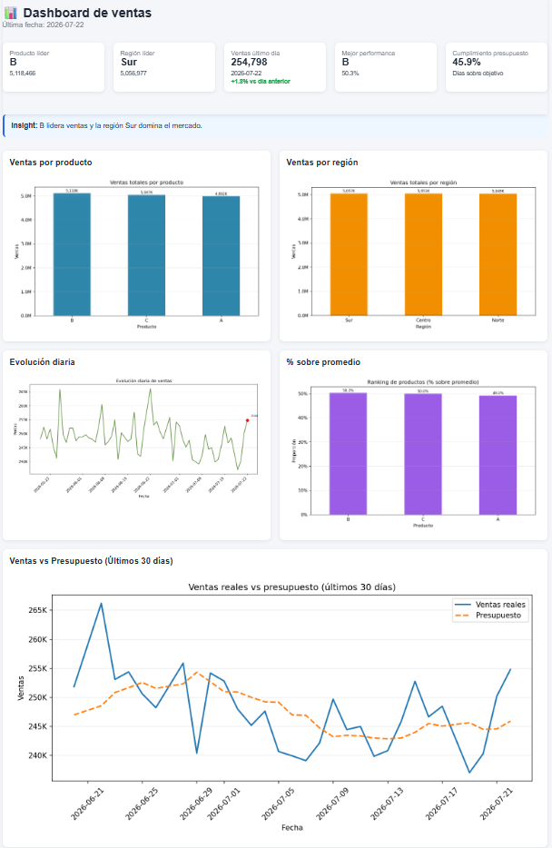

# 📊 Análisis de Ventas con Python + Presupuesto Dinámico

Pipeline de datos desarrollado en Python que automatiza el procesamiento de ventas, el cálculo de KPIs y el análisis de desempeño contra un presupuesto dinámico.

---

## 📊 Ejemplo de dashboard generado



---

## 🚀 Descripción

Este proyecto implementa un pipeline de datos end-to-end para el análisis de ventas.

Incluye:

- Ingesta de datos diarios
- Validaciones de calidad
- Consolidación de histórico
- Cálculo de KPIs
- Generación de reportes y visualizaciones
- Comparación de ventas reales vs presupuesto

Además, incorpora un análisis en notebook orientado a negocio, utilizando un dashboard que permite interpretar desvíos y performance diaria.

---

## 🎯 Objetivo

Transformar datos en información accionable mediante automatización del reporting y análisis de desempeño comercial.

---

## ⚙️ Tecnologías utilizadas

- Python
- pandas
- matplotlib
- Jupyter Notebook
- VS Code

---

## 📈 Funcionalidades principales

✔ Procesamiento automático de datos  
✔ Pipeline idempotente (sin duplicación de cargas)  
✔ Control de calidad de datos  
✔ Cálculo de KPIs por producto y región  
✔ Generación de gráficos e insights  
✔ Dashboard HTML automático  
✔ Comparación vs ventas del día anterior  
✔ Integración con presupuesto dinámico  

---

## 📊 Presupuesto dinámico

Se implementó un modelo de presupuesto basado en un **promedio móvil de 7 días**, lo que permite:

- Evitar métricas artificiales (100% cumplimiento constante)
- Generar desvíos realistas
- Analizar días de sobrecumplimiento y bajo desempeño
- Mejorar la capacidad de monitoreo operativo

---

## 🛡️ Mejora: control de duplicados en histórico

Durante el desarrollo se detectó un problema de duplicación de datos en el histórico.

Se implementó una solución que:

- Reemplaza registros por fecha en lugar de concatenarlos
- Evita reprocesamientos duplicados
- Garantiza consistencia del histórico
- Permite re-ejecución segura del pipeline (idempotencia)

Este ajuste resolvió un caso real de calidad de datos y mejoró la confiabilidad del análisis.

---

## 📂 Estructura del proyecto

analisis-ventas-python/
│
├── data/
│   ├── raw/
│   ├── processed/
│
├── output/
│   ├── modelo_dashboard.csv
│   ├── ventas_vs_presupuesto.csv
│   ├── resumen_presupuesto.csv
│   ├── charts/
│   └── reporte.html
│
├── src/
│   ├── update_pipeline.py
│   ├── generar_presupuesto.py
│   ├── kpi.py
│   ├── quality_checks.py
│   ├── reporting.py
│   ├── email_report.py
│   └── logging_setup.py
│
├── notebooks/
│   ├── dashboard_ventas_v3.ipynb
│   └── analisis_desvios_presupuesto.ipynb
│
└── README.md

---

## ▶️ Cómo ejecutar el proyecto

Ejecutar el pipeline completo:

```bash
python src/update_pipeline.py
```

El proceso incluye:

- Generación automática del presupuesto dinámico
- Actualización del histórico
- Cálculo de KPIs
- Generación de gráficos e insights
- Creación del dashboard HTML
```

## 📣 Autor

**Juan Manuel Cintado**

- 📧 Email: juanmanuel.cint@gmail.com
- 🔗 LinkedIn: https://www.linkedin.com/in/jmc76/

